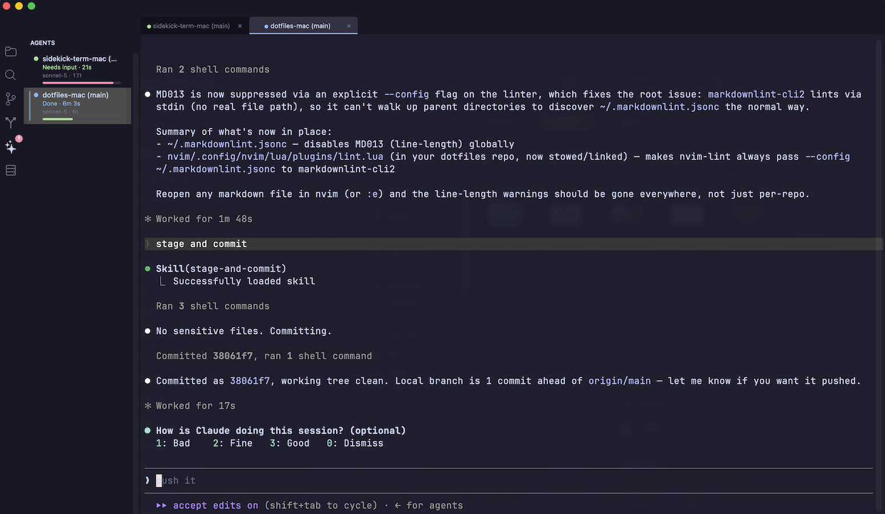

# Sidekick



Sidekick is a native macOS terminal built for AI agents.

Instead of treating Claude Code, Codex, and Pi like ordinary shell processes,
Sidekick understands what they're doing: it tracks each agent's state live and
tells you when one needs you, watches context usage as a session approaches
its token limit, isolates parallel agents into their own git worktrees, puts
their edits through an inline diff review before they land, and exposes the
entire terminal through [MCP](https://modelcontextprotocol.io), so agents
can orchestrate other agents.

It's also still a normal terminal (tabs, splits, session restore, a file
tree, a git panel), written in Swift and AppKit, not Electron. And every
opinionated bit (built-in editor vs. your own `$EDITOR`/nvim, sidebar
visibility, theme) is a config toggle, not a requirement.

## Features

**Terminal**: SwiftTerm-powered emulation, auto-detected shell, cwd + git
branch in the tab title, Catppuccin Mocha/Latte themes (or drop in your own
JSON palette), tabs, up to 4 splits per tab, and full session restore
(tabs/panes/cwd) across restarts.

**Sidebar**: Files (with git status and a hidden-file toggle), Search,
Git (stage/unstage/commit/push/pull), Worktrees (create/open/remove with a
guard against discarding uncommitted work), and Hosts (jump straight into an
`ssh` session for anything in `~/.ssh/config`).

**Agent orchestration**: an Agents dashboard with live state per tab and a
per-agent context-usage bar (green → yellow → red as a session's context
window fills up); macOS notifications and dock bounces when an agent needs
input or finishes; and an approval desk that reviews agent file edits before
they land. Claude Code edits are intercepted by a PreToolUse hook and Pi
edits by the Sidekick extension; both carry the edit to an inline diff card
in the Agents panel (accept, reject, or remember for the file, folder, or
session), and the desk's verdict answers the agent's own permission question,
so there is exactly one prompt, not two. The approval policy is configurable
(ask every edit, auto-approve edits, Claude's safety-checked Auto mode, or
fully autonomous) with `auto_allow`/`always_ask` glob overrides: an
`always_ask` path like `.env` parks at the desk even in fully autonomous
mode, and a rejection there holds. If Sidekick isn't running, the gate stays
silent and the agent's normal prompting takes over; nothing breaks. Codex
edits keep Codex's own in-terminal approvals: its hooks can veto a tool call
but not approve one, so routing them through the desk would just prompt
twice. One action spins up an isolated
git worktree, optionally launching an agent straight into it, so parallel
agents never fight over the same working tree.

**Editor**: a built-in editor with tree-sitter syntax highlighting (Swift,
Go, Rust, Python, TypeScript/JavaScript/JSX/TSX, Markdown), or set
`file_open_mode = "terminal"` to open files in your own `$EDITOR`/nvim
instead; the built-in editor is opt-in, not the only option.

**Scriptable down to the socket**: the `sidekick-mcp` server exposes pane
orchestration as native MCP tools (`pane_list`, `pane_split`, `pane_run`,
`pane_read`, `wait_agent_status`, and more) so Claude Code, Claude Desktop,
Cursor, or any other MCP client can drive Sidekick directly, and the
`sidekick-ctl` CLI talks to the same Unix socket for plain scripts, so any
agent or script, not just the ones running inside Sidekick, can list panes,
split them, run commands, and read output. See [MCP Server](#mcp-server).

**Quality of life**: quick open (`⌘P`) and a command palette (`⇧⌘P`),
paste an image straight into a terminal as a temp-file path, app-wide font
zoom, drag-to-reorder tabs, and `config.toml` changes that apply live with no
restart.

## Quick Start

### Run from Source
```bash
swift build
.build/debug/Sidekick
```

### Build the macOS App
```bash
# Build build/Sidekick.app, build/Sidekick.dmg, and build/Sidekick.zip
./build-app.sh

# Install by opening the DMG and dragging Sidekick to Applications
open build/Sidekick.dmg

# Or install to Applications non-interactively
./install.sh
```

Upgrading later is those same two commands, and nothing else: see
[Upgrading](#upgrading).

The app isn't notarized yet, so on first launch you may need to go to
System Settings → Privacy & Security → "Open Anyway" (macOS no longer
supports right-click → Open to bypass this on recent versions).

Then, two one-button setup steps:

- **Preferences → Agents**: auto-detects Claude Code, Codex, and Pi and
  hooks them into the Agents dashboard. This is the step that turns on the
  agent features Sidekick is built around: without it, agent status falls
  back to less reliable text heuristics and the context-usage bar has no
  data. Safe to re-run.
- **Preferences → Terminal → Install for zsh** (optional): shell integration
  for prompt marks, cwd tracking, and agent-exit cleanup.

Apple Silicon only for now; Intel would need a universal build
(`swift build --arch arm64 --arch x86_64`).

## Preferences

### Editor

**Preferences → Editor → File Tree Opens** picks what happens when you open
a file from the sidebar:
- **Terminal Editor**: opens it with `$EDITOR` (falling back to `nvim`) right
  in the terminal pane.
- **Built-in Editor**: opens it in Sidekick's own editor pane, with its own
  font/size, word-wrap, and tree-sitter syntax highlighting.

A separate checkbox toggles whether hidden (dot) files show up, dimmed, in
the file tree.

### Agents

**Preferences → Agents** has one row per supported agent (Claude Code, Codex,
Pi). Sidekick detects whether each is installed (by looking for its config
directory) and shows an **Install** button that is safe to click more than
once.
Installing wires that agent's own hook/extension system to a bundled status
helper so its state shows up live in the Agents dashboard and context-usage
bar:

- **Claude Code**: adds hooks to `~/.claude/settings.json` so prompt
  submission, tool use, permission requests, and session end/stop map to
  Sidekick's busy/ready/done/idle states, plus a hook that reports token
  usage and cost, plus the edit gate: a PreToolUse hook on Edit/Write that
  routes each file edit through the approval desk and answers Claude's
  permission question with the reviewer's decision.
- **Codex**: enables `hooks = true` and adds equivalent `[[hooks.<event>]]`
  status blocks to `~/.codex/config.toml`. Codex file edits are not routed
  through the approval desk: Codex's hooks can deny a tool call but cannot
  approve one (verified against the Codex source and its CLI's hook schemas),
  so a desk round-trip would duplicate Codex's own prompt. Codex keeps its
  flag-based approvals, and its permission prompts still surface as "Needs
  input" in the Agents panel.
- **Pi**: drops a TypeScript extension into `~/.pi/agent/extensions/` that
  reports status over OSC 666, forwards session transcripts for telemetry,
  and routes Pi's `edit`/`write` tools through the approval desk with the
  same fail-open contract as the Claude gate.

Approval behavior (ask-every-edit, auto-approve edits, Claude's Auto mode,
or fully autonomous) lives in the separate **Approvals** tab, not here.

## Keyboard Shortcuts

A few of the most-used ones; the full, always-current list is in the app
via `⌘K` ("Keyboard Shortcuts").

| Shortcut | Action |
|---|---|
| `⌘T` / `⌘W` | New tab / close tab |
| `⌘1`–`⌘9` | Switch to tab by number |
| `⌘D` / `⇧⌘D` | Split right / split down |
| `⌘[` / `⌘]` | Focus previous / next pane |
| `⇧⌘E` / `⇧⌘G` / `⇧⌘F` | Files / Git / Search panel |
| `⌘P` / `⇧⌘P` | Quick open / command palette |
| `⇧⌘J` | Jump to the next agent that needs attention |
| `⌘B` | Toggle sidebar |
| `⌘=` / `⌘-` / `⌘0` | Zoom in / out / reset |
| `⌘,` | Preferences |
| `` ⌃` `` | Toggle the arcade panel (opt-in, see below) |

## Extras

Optional modules, all off by default. Enable them in Preferences ▸ Extras
or per section in `~/.config/sidekick/config.toml`.

**Arcade** (`[arcade] enabled = true`): a floating panel of mini-games for
the dead time while agents churn, in the spirit of Ghostty's and iTerm2's
quick-terminal windows. `` ⌃` `` toggles it; hiding pauses the game and
everything is remembered across toggles and app relaunches in
`~/.config/sidekick/arcade.json`. Games are self-contained modules behind
an `ArcadeGame` protocol, with a picker in the panel. Use the always-visible
**How to Play** button or press **⌘?** for directions in any game. A handful
so far:

- **Blocks**: a falling-blocks classic. Ghost piece, hold, 7-bag, levels.
- **Depth Ladder**: an endless tower of picross-style deduction puzzles,
  built for 90-second check-ins between agent runs. Floors grow from 5x5
  to 15x15 as you descend; your permanent stat is your depth. Wrong fills
  cost one of three mistakes; a failed floor burns one of three daily
  lanterns, and at zero the tower goes dark until midnight. Every puzzle
  is generated solvable by pure line logic, never guessing.
- **Two Lines**: the opposite of a game — a palate cleanser. Each open
  shows one gentle prompt ("a sound you can hear right now") and a small
  text box; write a line or two, or don't. Entries append to
  `~/.config/sidekick/two-lines.md`, a plain markdown journal you own.
  No scores, no streaks, no fail state; drafts survive closing the panel.
- **The Grove**: a bonsai in text that grows very slowly in real time, one
  tick per three hours you are away, capped so a week off is a pleasant jump
  rather than a stranger. Open it to prune a branch, bend one a few degrees,
  plant a seed, or just look; it cannot die and there is no right shape.
  Three species as moods (pine, maple, willow); plantings and clearings are
  logged to `~/.config/sidekick/grove.md`, a plain markdown file you own.
- **The Walk**: an endless procedural landscape strolled a few steps at a
  time, described in spare field-notebook prose. Space takes a step; biomes
  drift along a plausible map, weather shifts on a slow chain, and now and
  then there is a small finding: a gull's feather, a worn coin, a fox skull.
  No destination and no counter to fill. Findings and each new place accrue
  in `~/.config/sidekick/the-walk.md`, a plain markdown journal you own.
- **Slow Cartography**: mapping a generated coastline by hand, a few pen
  strokes per visit. Drag to survey; the world is invisible until you draw
  it, so the chart is only ever what you have traced. Name a bay whatever you
  like, sketch in a hill, watch the shoreline emerge where land meets sea.
  The pen holds a little ink per visit and refills on open; nothing counts
  down. Export sheets to `~/.config/sidekick/atlas.md`, an atlas you own.

## MCP Server

`sidekick-mcp` exposes Sidekick's pane orchestration as MCP tools over
stdio, so any MCP client can drive it directly, with no `sidekick-ctl`
shell-outs needed:

```json
{ "mcpServers": { "sidekick": { "command": "/path/to/sidekick-mcp" } } }
```

```bash
# Register it with Claude Code (also installs a build to ~/.local/bin)
scripts/install-agent-status-hooks

# Or point Claude Code at the copy inside the app bundle directly
claude mcp add --scope user sidekick /Applications/Sidekick.app/Contents/MacOS/sidekick-mcp
```

Tools: `pane_list` / `pane_current` / `pane_split` / `pane_focus` /
`pane_close`, `pane_send_text` / `pane_run` / `pane_send_key`, `pane_read`
(incl. `--json` command records), `wait_agent_status` / `wait_output`, and
`new_tab`. Honors `SIDEKICK_SOCKET_PATH` (default
`~/.config/sidekick/sidekick.sock`).

## Pane Automation (`sidekick-ctl`)

For scripts and agents that want lower-level control, `sidekick-ctl` talks to
the same Unix socket the MCP server uses:

```bash
# Discover panes and the caller's own pane
sidekick-ctl pane list
sidekick-ctl pane current

# Split and launch a process without changing UI focus
sidekick-ctl pane split "$SIDEKICK_PANE_ID" \
  --direction right --cwd "$PWD" --no-focus --exec claude

# Fan an agent out onto its own git worktree (created if needed)
sidekick-ctl pane split "$SIDEKICK_PANE_ID" \
  --worktree feature/login --no-focus --exec claude

# Control a pane, then block on it and read once (never poll in a loop)
sidekick-ctl pane run "$PANE_ID" "Review the API error handling"
sidekick-ctl wait agent-status "$PANE_ID" done --timeout 600000
sidekick-ctl pane read "$PANE_ID" --source visible --lines 60

# Need history rather than a progress peek? Read the scrollback transcript, and
# pass the cursor it prints back as --since so the next read is only the delta
sidekick-ctl pane read "$PANE_ID" --source recent --lines 200

# Subscribe to a live JSONL event stream: agent-state transitions,
# command completions, and edit-approval decisions
sidekick-ctl events --follow
```

`pane split --worktree <branch>` resolves the git repo containing the source
pane, creates (or reuses) a worktree for that branch in a sibling
`<repo>.worktrees/<branch>` directory, and opens the new pane there.

### Claude/Codex Agent Status Hooks

Sidekick can drive tab status indicators from Claude Code and Codex
lifecycle hooks, which is more reliable than parsing terminal text. Opt in
either from the app (**Preferences → Agents**, one button per agent) or, from a
source checkout, with:

```bash
scripts/install-agent-status-hooks
```

This builds `sidekick-agent-status`, installs it to `~/.local/bin`, installs the
`sidekick-panes` skill for each agent, and adds hooks to
`~/.claude/settings.json` and `~/.codex/config.toml` (`UserPromptSubmit` → busy,
`PermissionRequest` → ready, `Stop` → done). Restart open Claude Code/Codex
sessions after installing.

That is a one-time opt-in, and the only time you run it by hand. Keeping it
current afterwards is the upgrade path's job.

## Upgrading

Two paths, each complete on its own:

- **From source**: `./build-app.sh && ./install.sh`. Having installed the app,
  `install.sh` refreshes the integration you already have: the `~/.local/bin`
  helpers, the `sidekick-panes` skill, and the hook entries. It does that by
  re-running `scripts/install-agent-status-hooks` for you, against the app bundle
  it just installed, so there is no second release build. If you never opted in,
  it changes nothing and prints the one line telling you how.
- **Installed .app**: launch it. On launch Sidekick replaces any `~/.local/bin`
  helper that differs from the one this build ships (atomically, so a hook firing
  mid-swap never sees a partial binary), re-syncs the installed `sidekick-panes`
  skill the same way, and adds any hook entry the contract has gained since you
  installed.

What Sidekick will not do on launch is create something you never installed. A
helper you don't have is not written; a skills directory you don't have is not
created; an agent whose config never mentioned Sidekick is not edited. The one
file that is yours rather than ours, `settings.json` or `config.toml`, is touched
only when an integration is already there and is missing part of the current hook
contract; a current one is never opened for writing. The corollary, stated
plainly: delete a single Sidekick hook entry and the next launch puts it back,
because on disk that is indistinguishable from an install predating the entry.
Removing the integration, meaning all of Sidekick's entries, is the way to opt
out, and that does stick.

Running from source with `swift run` deliberately skips all of this: a working
tree is a moving target, and a feature branch would otherwise overwrite your
installed helpers with whatever is on it. Re-run `./install.sh` (or
`scripts/install-agent-status-hooks`) after pulling instead.

If a pane's hook is still running a helper older than the app's wire protocol,
Sidekick says so once in that pane, and logs it to
`~/Library/Logs/Sidekick/Sidekick.log`. The report is still honored: a stale
helper is a warning, never a rejection.

## Configuration

Sidekick loads `~/.config/sidekick/config.toml`, created with defaults on
first launch. Changes apply live; no restart needed.

```toml
[theme]
name = "catppuccin-mocha"    # catppuccin-mocha | catppuccin-latte | auto (follow macOS)

[font]
family = "Menlo"
size = 13
bold_is_bright = true

[cursor]
shape = "block"              # block | ibeam | underline
blink = true

[window]
padding = 8
opacity = 0.9
enable_blur = true

[approval]
mode = "ask"                 # ask | auto | claude-auto | bypass; flags applied to agents launched in panes
auto_allow = []              # globs approved silently even under "ask", e.g. ["docs/**"]
always_ask = []              # globs that always park at the approval desk, even under auto/bypass, e.g. [".env"]
worktree_auto_approve = false # silently approve edits that stay inside a pane's own registered worktree

[behavior]
scrollback_lines = 10000     # -1 for unlimited
scroll_on_output = false
scroll_on_keystroke = true
allow_hyperlinks = true
mouse_autohide = true
audible_bell = false
restore_session = true
confirm_close = true         # ask before Cmd+W / Shift+Cmd+W closes a tab or pane

[shell]
program = ""                 # empty = use $SHELL
args = []
default_cwd = "~"

[diff]
context_lines = 3

[editor]
file_open_mode = "terminal"  # terminal ($EDITOR/nvim) | builtin (Sidekick's editor pane)
font_family = ""
word_wrap = true
font_size = 13
show_hidden_files = false
```

Drop custom theme palettes (same JSON schema as the built-ins) into
`~/.config/sidekick/themes/`.

## Requirements

- macOS 13.0+ (Ventura)
- Swift 6.2+ toolchain (Xcode 26+) to build from source

## Dependencies

- [SwiftTerm](https://github.com/migueldeicaza/SwiftTerm): terminal emulation
- [TOMLKit](https://github.com/LebJe/TOMLKit): config file parsing
- [SwiftTreeSitter](https://github.com/ChimeHQ/SwiftTreeSitter) + per-language
  tree-sitter grammars: editor syntax highlighting

## License

MIT; see [LICENSE](LICENSE).
